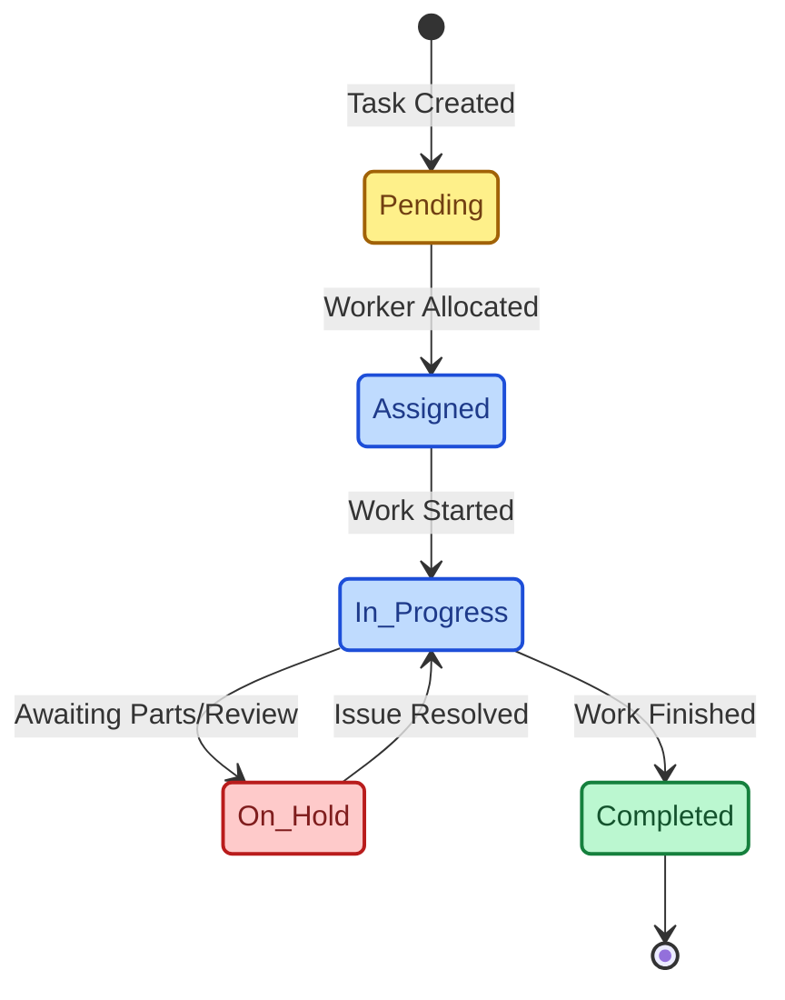
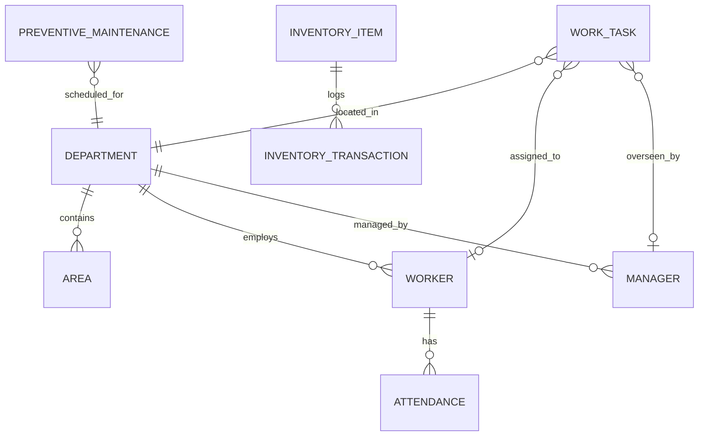

<div align="center">
  <h1>🏢 VSBEC CMMS</h1>
  <p><strong>Campus Maintenance Management System</strong></p>
  <p>A production-ready Enterprise Progressive Web Application built for engineering colleges to manage all maintenance activities seamlessly.</p>
</div>

<br/>

## 🌟 Overview
The VSBEC CMMS is a robust, mobile-first web application designed to digitize and streamline campus maintenance operations. From managing worker attendance to tracking inventory and scheduling preventive maintenance, the system provides a unified platform for facility managers and technical staff.

---

## 🏗 System Architecture

The application is built on a modern serverless stack, ensuring high performance, scalability, and seamless real-time updates.

```mermaid
graph TD
    classDef ui fill:#3b82f6,stroke:#1d4ed8,stroke-width:2px,color:#fff,rx:5px,ry:5px;
    classDef core fill:#8b5cf6,stroke:#6d28d9,stroke-width:2px,color:#fff,rx:5px,ry:5px;
    classDef db fill:#10b981,stroke:#047857,stroke-width:2px,color:#fff,rx:5px,ry:5px;

    Client["📱 Client App (Browser / PWA)"]:::ui
    
    subgraph Frontend [Next.js App Router (React)]
        UI["🎨 Shadcn UI + Tailwind"]:::core
        State["🔄 TanStack Query (React Query)"]:::core
        Excel["📊 SheetJS (Excel Processor)"]:::core
    end

    subgraph Backend [Backend as a Service]
        Auth["🔐 Supabase Auth"]:::db
        RLS["🛡️ Row Level Security"]:::db
        Postgres["🗄️ PostgreSQL Database"]:::db
    end

    Client --> UI
    UI --> State
    State --> Excel
    UI --> Auth
    State --> RLS
    RLS --> Postgres
```

---

## 🚀 Key Features

- **👥 Workforce Management**: Complete control over Departments, Areas, Managers, and Workers with fast, mobile-optimized daily attendance logging.
- **🛠️ Work Allocation**: Kanban boards and list views to track tasks, prioritize maintenance, and assign specific workers.
- **📦 Inventory & Materials**: Complete lifecycle tracking of items with `stock_in` and `stock_out` transactions and Low Stock alerts.
- **📅 Preventive Maintenance (PM)**: Create automated recurring jobs (Daily, Weekly, Monthly, etc.) to ensure assets are properly maintained.
- **📈 Executive Dashboard**: Real-time KPI charts and business intelligence analytics powered by Recharts.
- **📄 Advanced Reports & Bulk Operations**: Custom Report Builder for exporting to `.xlsx`/`.csv`. Includes a powerful Bulk Excel Upload feature for rapid task creation.

---

## 🔄 Task Lifecycle Workflow



---

## 🗄️ Core Data Model



---

## 💻 Tech Stack

- **Framework**: [Next.js 16](https://nextjs.org/) (App Router)
- **UI/UX**: [Tailwind CSS](https://tailwindcss.com/), [Shadcn/UI](https://ui.shadcn.com/), [Lucide Icons](https://lucide.dev/)
- **Data Fetching & State**: [TanStack Query](https://tanstack.com/query) (React Query)
- **Database & Auth**: [Supabase](https://supabase.com/) (PostgreSQL + RLS Policies)
- **Analytics**: [Recharts](https://recharts.org/)
- **Export/Import**: [SheetJS](https://sheetjs.com/) (xlsx), `react-to-print`

---

## ⚙️ Getting Started

### Prerequisites
- Node.js (v18+)
- npm or pnpm
- A Supabase Project

### Installation

1. **Clone the repository**
   ```bash
   git clone https://github.com/projectvsbec-ops/CMMS.git
   cd CMMS
   ```

2. **Install Dependencies**
   ```bash
   npm install
   ```

3. **Environment Setup**
   Create a `.env.local` file in the root directory and add your Supabase credentials:
   ```env
   NEXT_PUBLIC_SUPABASE_URL=your_supabase_project_url
   NEXT_PUBLIC_SUPABASE_ANON_KEY=your_supabase_anon_key
   ```

4. **Database Initialization**
   Apply the migrations found in `supabase/migrations/` to your Supabase project to set up the necessary tables, enums, and Row Level Security (RLS) policies.

5. **Run Development Server**
   ```bash
   npm run dev
   ```
   Open [http://localhost:3000](http://localhost:3000) in your browser.

---

## 📂 Project Structure

```text
├── src/
│   ├── app/                # Next.js App Router pages & layouts
│   ├── components/         # Shared UI components (Shadcn, Layouts)
│   ├── features/           # Feature-based modules (Work, Inventory, Reports, etc.)
│   │   ├── activity-logs/
│   │   ├── areas/
│   │   ├── attendance/
│   │   ├── dashboard/
│   │   ├── departments/
│   │   ├── inventory/
│   │   ├── managers/
│   │   ├── preventive-maintenance/
│   │   ├── reports/
│   │   ├── schedule/
│   │   ├── settings/
│   │   ├── work/
│   │   └── workers/
│   ├── lib/                # Utility functions, constants, Supabase clients
│   └── types/              # TypeScript interfaces and type definitions
├── supabase/
│   └── migrations/         # PostgreSQL schema and RLS policies
├── public/                 # Static assets (manifest, icons)
└── package.json            # Project dependencies and scripts
```
