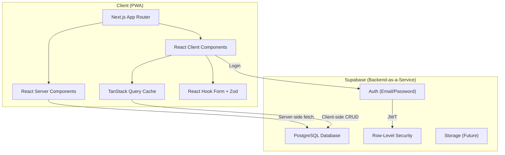
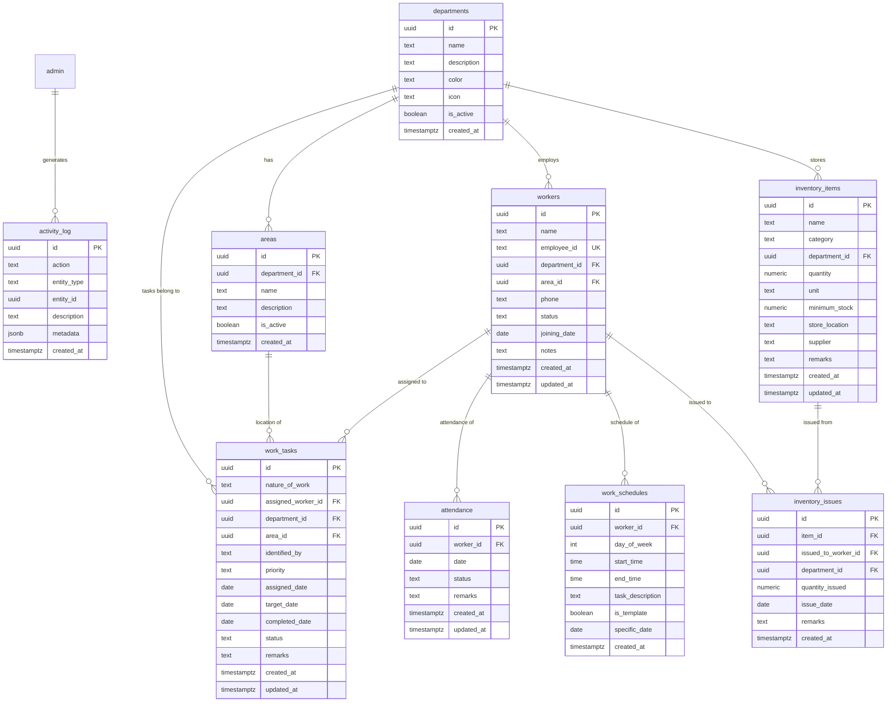
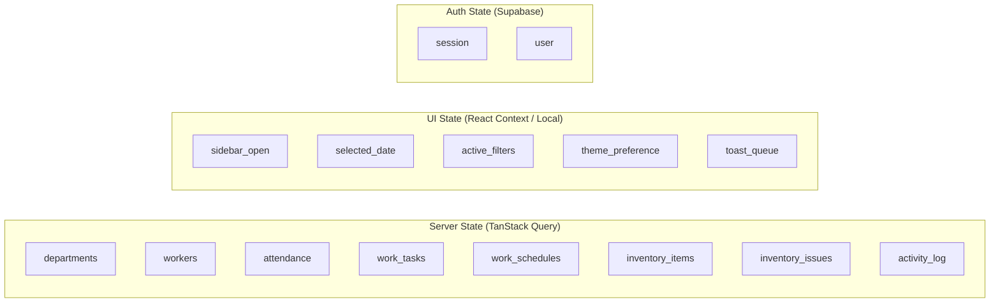

# Campus Maintenance Management System (CMMS) — Architecture & Implementation Plan

## 1. Executive Summary

A single-admin Progressive Web Application for managing all maintenance operations within an engineering college campus. The system covers worker management, attendance tracking, work allocation, scheduling, inventory control, and reporting — all accessible from any device.

**Single user. Zero complexity overhead. Maximum utility.**

---

## 2. Requirements Analysis

### 2.1 Functional Requirements (Given)

| Module | Key Capabilities |
|:---|:---|
| **Dashboard** | Today's attendance, pending/completed/overdue works, inventory alerts, department summary, quick actions, recent activity |
| **Departments** | CRUD for departments (data-driven, not hardcoded) |
| **Workers** | CRUD with attendance history, work history, schedule view |
| **Attendance** | One-tap marking (Present / Absent / Leave / Half Day), daily view |
| **Work Allocation** | Task CRUD with 5 statuses, assignment, priority, dates, remarks |
| **Work Schedule** | Worker daily timetable with time-slot management |
| **Inventory** | Item CRUD, issue tracking, low-stock alerts |
| **Reports** | Attendance, Work, Inventory reports with PDF & Excel export |
| **Settings** | Admin profile, app preferences |
| **Auth** | Single admin login via Supabase Auth |

### 2.2 Identified Missing / Implicit Requirements

> [!IMPORTANT]
> The following are requirements I've inferred from the domain but were not explicitly stated. Please confirm or reject each.

| # | Inferred Requirement | Recommendation |
|:--|:---|:---|
| 1 | **Department Areas/Locations** — Tasks reference an "Area/Location." Should areas be a managed list (per department) or free-text? | **Managed list** per department (e.g., "Block A — Room 101") for consistent filtering and reporting. Free-text fallback via an "Other" option. |
| 2 | **Inventory Issue Tracking** — "Maintain inventory issue history" implies a separate `inventory_issues` table logging who took what, when, and how much. | Yes — track each issue as: item, quantity issued, issued to (worker/department), date, remarks. |
| 3 | **Work Schedule Templates** — Should schedules support a "template" concept (e.g., a default weekly schedule) vs. setting slots per-day-per-worker? | **Default template per worker** that can be overridden on specific dates. Keeps data entry minimal. |
| 4 | **Audit Trail / Activity Log** — "Recent Activities" on the dashboard implies logging key actions (attendance marked, task created, inventory issued). | A lightweight `activity_log` table recording action, entity, timestamp. |
| 5 | **Data Archival** — Old attendance and work records will grow. Should completed/old records be archivable? | Not in Phase 1. Use date-range filtering. Revisit if performance degrades. |
| 6 | **Notifications** — Should the admin receive in-app alerts for overdue tasks or low stock? | **Yes** — in-app notification badge using computed queries (no push notifications in Phase 1). |
| 7 | **Bulk Operations** — Mark attendance for all workers at once? Bulk-assign tasks? | **Attendance**: Default all as "Present" with ability to change individuals (optimized one-tap). **Tasks**: Single assignment for now. |
| 8 | **Dashboard Date Selection** — Should the dashboard default to "today" but allow viewing other dates? | **Yes** — date picker on dashboard for historical views. |

---

## 3. System Architecture

### 3.1 High-Level Architecture



### 3.2 Key Architecture Decisions

| Decision | Choice | Rationale |
|:---|:---|:---|
| **Rendering** | Server Components for pages + Client Components for interactivity | Fast initial loads, minimal JS bundle |
| **Data Fetching** | TanStack Query with Supabase client | Client-side cache, mutations, optimistic updates |
| **Forms** | React Hook Form + Zod | Performant forms, schema-based validation |
| **State Management** | TanStack Query (server state) + React Context (UI state only) | No Redux/Zustand needed — server state is the source of truth |
| **Auth** | Supabase Auth with email/password | Single admin, simple JWT-based session |
| **Styling** | Tailwind CSS + shadcn/ui | Rapid development, consistent design, accessible components |
| **PWA** | Native Next.js manifest + manual service worker | No legacy `next-pwa` dependency |
| **Export** | `jspdf` + `jspdf-autotable` (PDF), `xlsx` (Excel) | Client-side generation, no server needed |

---

## 4. Database Schema

### 4.1 Entity Relationship Diagram



### 4.2 Schema Notes

| Table | Notes |
|:---|:---|
| `departments` | `color` and `icon` fields for UI theming. `is_active` for soft-delete. |
| `areas` | Scoped to department. Enables structured location tracking. |
| `workers` | `status` is enum-like: `active`, `inactive`, `on_leave`. `employee_id` is unique business key. |
| `attendance` | Unique constraint on `(worker_id, date)` — one record per worker per day. `status`: `present`, `absent`, `leave`, `half_day`. |
| `work_tasks` | `priority`: `low`, `medium`, `high`, `urgent`. `status`: `pending`, `in_progress`, `completed`, `delayed`, `cancelled`. |
| `work_schedules` | `is_template = true` → default weekly slot. `specific_date` → override for a particular day. `day_of_week`: 0 (Sun) to 6 (Sat). |
| `inventory_items` | `minimum_stock` triggers low-stock alerts when `quantity < minimum_stock`. |
| `inventory_issues` | Decrements `inventory_items.quantity` via Supabase RPC or trigger. |
| `activity_log` | Write-only append log. Powers "Recent Activities" on the dashboard. `metadata` stores contextual JSON. |

### 4.3 Indexes

```sql
-- High-frequency queries
CREATE INDEX idx_attendance_worker_date ON attendance(worker_id, date);
CREATE INDEX idx_attendance_date ON attendance(date);
CREATE INDEX idx_work_tasks_status ON work_tasks(status);
CREATE INDEX idx_work_tasks_assigned ON work_tasks(assigned_worker_id);
CREATE INDEX idx_work_tasks_department ON work_tasks(department_id);
CREATE INDEX idx_work_tasks_target_date ON work_tasks(target_date);
CREATE INDEX idx_workers_department ON workers(department_id);
CREATE INDEX idx_workers_status ON workers(status);
CREATE INDEX idx_inventory_items_department ON inventory_items(department_id);
CREATE INDEX idx_inventory_items_low_stock ON inventory_items(quantity, minimum_stock);
CREATE INDEX idx_inventory_issues_item ON inventory_issues(item_id);
CREATE INDEX idx_work_schedules_worker ON work_schedules(worker_id);
CREATE INDEX idx_activity_log_created ON activity_log(created_at DESC);
```

### 4.4 Row-Level Security

Since this is a single-admin app, RLS policies are simple:

```sql
-- All tables: Allow full access only to authenticated users
CREATE POLICY "Admin full access" ON <table_name>
  FOR ALL
  USING (auth.role() = 'authenticated')
  WITH CHECK (auth.role() = 'authenticated');
```

---

## 5. Navigation & Page Hierarchy

### 5.1 Route Structure

```
/ ─────────────────── Login (redirect to /dashboard if authenticated)

/(app)/ ────────────── Authenticated Layout (sidebar + header)
  ├── dashboard ────── Dashboard overview
  ├── departments ──── Department list
  │   └── [id] ─────── Department detail (workers, tasks, inventory in dept)
  ├── workers ──────── Worker list
  │   ├── new ──────── Add worker (sheet/modal)
  │   └── [id] ─────── Worker detail (profile, attendance, tasks, schedule)
  ├── attendance ───── Daily attendance grid
  │   └── history ──── Attendance history & calendar view
  ├── work ─────────── Work allocation list
  │   ├── new ──────── Create task (sheet/modal)
  │   └── [id] ─────── Task detail
  ├── schedule ─────── Weekly schedule view
  │   └── [workerId] ─ Worker schedule editor
  ├── inventory ────── Inventory list
  │   ├── new ──────── Add item (sheet/modal)
  │   ├── [id] ─────── Item detail + issue history
  │   └── issue ────── Issue inventory form
  ├── reports ──────── Report selection & generation
  └── settings ─────── Admin settings
```

### 5.2 Navigation Design

| Viewport | Navigation Pattern |
|:---|:---|
| **Mobile** | Bottom tab bar (5 primary: Dashboard, Attendance, Work, Inventory, More) + "More" reveals full menu in a sheet |
| **Tablet** | Collapsible sidebar (icon-only by default) |
| **Desktop** | Persistent sidebar with labels |

---

## 6. UI Component Architecture

### 6.1 shadcn/ui Components to Install

These are the base components we'll pull from shadcn/ui and customize:

```
button, card, dialog, sheet, drawer, form, input, select,
textarea, table, badge, alert, tabs, calendar, date-picker,
dropdown-menu, popover, separator, skeleton, toast, tooltip,
avatar, command, label, switch, checkbox, radio-group, scroll-area
```

### 6.2 Custom App Components

| Component | Purpose |
|:---|:---|
| `AppShell` | Main layout with responsive sidebar/bottom-nav |
| `PageHeader` | Consistent page title + actions bar |
| `StatCard` | Dashboard metric card (icon, value, label, trend) |
| `EmptyState` | Illustration + message when lists are empty |
| `DataTable` | Wrapper around shadcn table with sorting, filtering, pagination |
| `StatusBadge` | Color-coded badge for task/worker/attendance status |
| `QuickAction` | Dashboard action button (icon + label) |
| `AttendanceChip` | One-tap attendance toggle chip |
| `TimeSlotEditor` | Inline editor for schedule time blocks |
| `SearchInput` | Debounced search with command palette support |
| `ConfirmDialog` | Reusable confirmation dialog for destructive actions |
| `FormSheet` | Side sheet wrapper for create/edit forms |
| `ActivityItem` | Single activity log entry (icon, description, timestamp) |
| `InventoryAlertBanner` | Low-stock warning banner |
| `DepartmentIcon` | Dynamic icon renderer based on department config |

---

## 7. Application State Management



**Rules:**
- All domain data flows through **TanStack Query** — no local state duplication.
- UI-only state (sidebar toggle, selected date, filters) uses **React `useState`** or **Context** (if shared across components).
- Auth state managed by **Supabase's `onAuthStateChange`** listener, wrapped in an `AuthProvider` context.

---

## 8. Project Folder Structure

```
src/
├── app/
│   ├── (auth)/
│   │   └── login/
│   │       └── page.tsx
│   ├── (app)/
│   │   ├── layout.tsx              ← AppShell (sidebar, header, bottom-nav)
│   │   ├── dashboard/
│   │   │   └── page.tsx
│   │   ├── departments/
│   │   │   ├── page.tsx
│   │   │   └── [id]/
│   │   │       └── page.tsx
│   │   ├── workers/
│   │   │   ├── page.tsx
│   │   │   └── [id]/
│   │   │       └── page.tsx
│   │   ├── attendance/
│   │   │   ├── page.tsx
│   │   │   └── history/
│   │   │       └── page.tsx
│   │   ├── work/
│   │   │   ├── page.tsx
│   │   │   └── [id]/
│   │   │       └── page.tsx
│   │   ├── schedule/
│   │   │   ├── page.tsx
│   │   │   └── [workerId]/
│   │   │       └── page.tsx
│   │   ├── inventory/
│   │   │   ├── page.tsx
│   │   │   ├── [id]/
│   │   │   │   └── page.tsx
│   │   │   └── issue/
│   │   │       └── page.tsx
│   │   ├── reports/
│   │   │   └── page.tsx
│   │   └── settings/
│   │       └── page.tsx
│   ├── manifest.ts                 ← PWA manifest
│   ├── layout.tsx                  ← Root layout (providers, fonts)
│   └── page.tsx                    ← Redirect to /login or /dashboard
│
├── components/
│   ├── ui/                         ← shadcn/ui base components
│   ├── layout/
│   │   ├── app-shell.tsx
│   │   ├── sidebar.tsx
│   │   ├── bottom-nav.tsx
│   │   ├── header.tsx
│   │   └── page-header.tsx
│   ├── shared/
│   │   ├── data-table.tsx
│   │   ├── stat-card.tsx
│   │   ├── status-badge.tsx
│   │   ├── empty-state.tsx
│   │   ├── confirm-dialog.tsx
│   │   ├── form-sheet.tsx
│   │   ├── search-input.tsx
│   │   └── loading-skeleton.tsx
│   └── icons/                      ← Custom SVG icons if needed
│
├── features/
│   ├── auth/
│   │   ├── components/
│   │   ├── hooks/
│   │   └── auth-provider.tsx
│   ├── dashboard/
│   │   ├── components/
│   │   └── hooks/
│   ├── departments/
│   │   ├── components/
│   │   ├── hooks/
│   │   └── types.ts
│   ├── workers/
│   │   ├── components/
│   │   ├── hooks/
│   │   ├── schemas.ts              ← Zod schemas
│   │   └── types.ts
│   ├── attendance/
│   │   ├── components/
│   │   ├── hooks/
│   │   └── types.ts
│   ├── work/
│   │   ├── components/
│   │   ├── hooks/
│   │   ├── schemas.ts
│   │   └── types.ts
│   ├── schedule/
│   │   ├── components/
│   │   ├── hooks/
│   │   └── types.ts
│   ├── inventory/
│   │   ├── components/
│   │   ├── hooks/
│   │   ├── schemas.ts
│   │   └── types.ts
│   └── reports/
│       ├── components/
│       ├── hooks/
│       └── export-utils.ts
│
├── hooks/                          ← Global hooks
│   ├── use-debounce.ts
│   ├── use-media-query.ts
│   └── use-local-storage.ts
│
├── lib/
│   ├── supabase/
│   │   ├── client.ts               ← Browser Supabase client
│   │   ├── server.ts               ← Server Supabase client
│   │   ├── middleware.ts            ← Auth middleware
│   │   └── types.ts                ← Generated DB types
│   ├── constants.ts
│   └── utils.ts                    ← cn() and shared helpers
│
├── types/
│   └── index.ts                    ← Shared TypeScript types
│
└── styles/
    └── globals.css                 ← Tailwind base + custom tokens
```

---

## 9. Key Technical Patterns

### 9.1 Supabase Service Layer

Each feature will have a service file exposing typed CRUD functions:

```typescript
// Example: features/workers/hooks/use-workers.ts
export function useWorkers(filters?: WorkerFilters) {
  return useQuery({
    queryKey: ['workers', filters],
    queryFn: () => supabase
      .from('workers')
      .select('*, department:departments(*), area:areas(*)')
      .match(filters)
      .order('name'),
  });
}

export function useCreateWorker() {
  const queryClient = useQueryClient();
  return useMutation({
    mutationFn: (data: WorkerInsert) =>
      supabase.from('workers').insert(data).select().single(),
    onSuccess: () => queryClient.invalidateQueries({ queryKey: ['workers'] }),
  });
}
```

### 9.2 Form Pattern

```typescript
// Example: features/workers/schemas.ts
export const workerSchema = z.object({
  name: z.string().min(1, 'Name is required'),
  employee_id: z.string().min(1, 'Employee ID is required'),
  department_id: z.string().uuid(),
  area_id: z.string().uuid().optional(),
  phone: z.string().optional(),
  status: z.enum(['active', 'inactive', 'on_leave']),
  joining_date: z.string(),
  notes: z.string().optional(),
});
```

### 9.3 Attendance One-Tap Pattern

The attendance page will render a list of all active workers with a single `AttendanceChip` component per worker. Tapping cycles through: **Present → Absent → Leave → Half Day → Present**. Changes are debounced and batched into a single upsert.

---

## 10. PWA Configuration

| Feature | Implementation |
|:---|:---|
| **Manifest** | `app/manifest.ts` using Next.js `MetadataRoute.Manifest` |
| **Service Worker** | Manual `public/sw.js` with cache-first strategy for static assets |
| **Icons** | 192×192 and 512×512 PNG icons |
| **Install Prompt** | "Add to Home Screen" banner on mobile |
| **Offline** | Cache app shell; show "offline" banner when data can't sync |

---

## 11. Report Export Strategy

| Format | Library | Approach |
|:---|:---|:---|
| **PDF** | `jspdf` + `jspdf-autotable` | Client-side generation with formatted tables, headers, date ranges |
| **Excel** | `xlsx` (SheetJS) | Client-side `.xlsx` generation with multiple sheets |

Reports will be generated on-demand with the current filter state. No server-side rendering needed.

---

## 12. Phased Implementation Roadmap

### Phase 1 — Foundation (Estimated: 2–3 sessions)

| Step | Task |
|:---|:---|
| 1.1 | Scaffold Next.js project with TypeScript, Tailwind CSS, shadcn/ui |
| 1.2 | Configure Supabase client (browser + server) |
| 1.3 | Set up authentication (login page, auth middleware, session management) |
| 1.4 | Build `AppShell` layout (responsive sidebar, bottom-nav, header) |
| 1.5 | Set up TanStack Query provider |
| 1.6 | Create PWA manifest and service worker |
| 1.7 | Install all needed shadcn/ui components |
| 1.8 | Create shared components (`DataTable`, `StatCard`, `StatusBadge`, `EmptyState`, etc.) |

### Phase 2 — Core Data Modules (Estimated: 3–4 sessions)

| Step | Task |
|:---|:---|
| 2.1 | **Departments** — CRUD, area management |
| 2.2 | **Workers** — CRUD, detail page with tabs (profile, attendance, tasks, schedule) |
| 2.3 | **Attendance** — Daily marking grid, history view, calendar |

### Phase 3 — Work Management (Estimated: 2–3 sessions)

| Step | Task |
|:---|:---|
| 3.1 | **Work Allocation** — Task CRUD, filtering, status management |
| 3.2 | **Work Schedule** — Template editing, daily overrides, visual timetable |

### Phase 4 — Inventory & Dashboard (Estimated: 2–3 sessions)

| Step | Task |
|:---|:---|
| 4.1 | **Inventory** — Item CRUD, issue tracking, low-stock alerts |
| 4.2 | **Dashboard** — All stat cards, summaries, quick actions, recent activity |

### Phase 5 — Reports & Polish (Estimated: 1–2 sessions)

| Step | Task |
|:---|:---|
| 5.1 | **Reports** — Attendance, Work, Inventory reports with PDF/Excel export |
| 5.2 | **Settings** — Admin profile, app preferences |
| 5.3 | **Polish** — Loading states, error handling, accessibility audit, performance optimization |

---

## Open Questions

> [!IMPORTANT]
> Please review and answer these before we begin implementation:

1. **Supabase Project** — Do you already have a Supabase project created? If yes, do you have the project URL and anon key ready? If not, should I include steps to set one up?

2. **Department Areas** — Should areas/locations be a structured managed list (per department), or is free-text sufficient for the "Area/Location" field on tasks?

3. **Work Schedule Defaults** — Should all workers share the same default schedule template (the 5-slot example you provided), or can each worker have a unique default?

4. **Inventory Issue Flow** — When inventory is issued, should the quantity automatically decrement from stock? Should there be a "return" flow?

5. **Activity Log Scope** — Which actions should be logged? My recommendation: attendance marked, task created/updated/completed, inventory issued, worker added/updated. Confirm or adjust.

6. **Color Theme** — Do you have a preferred brand color or palette? Otherwise I'll design a professional dark/light theme with a neutral blue-slate palette.

7. **Seeding Data** — Should I pre-seed the 7 default departments (Indoor, Outdoor, Hostel Maintenance, Electrical, Transport, Mess, Purchase) in the database migration, or should the admin create them manually?

---

## Verification Plan

### Automated Tests
- TypeScript strict mode compilation (`tsc --noEmit`)
- ESLint + Prettier checks
- Zod schema validation tests for all forms

### Manual Verification
- Responsive layout testing across mobile (375px), tablet (768px), desktop (1280px)
- PWA installability check via Chrome DevTools Application tab
- All CRUD flows tested end-to-end against Supabase
- PDF and Excel export validation
- Attendance one-tap flow performance check
